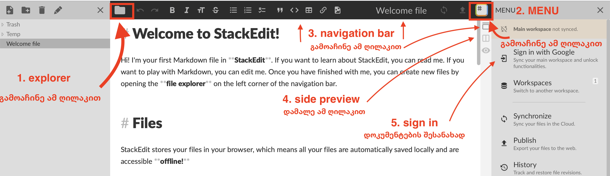

# ბონუს თემა/პრეზენტაცია
ბონუს პრეზენტაციის ქულისთვის **ბლოგ პოსტის** სტილში უნდა დაწეროთ თემა/სტატია ტექნოლოგიებთან დაკავშირებით. google doc და microsoft word-ის მაგივრად, ტექსტს დაწერთ markdown ფორმატში. ასევე, დავალებას აქვს შუალედური დედლაინები. ეს დავალება  ინდივიდუალურად კეთდება (ანუ გუნდურად არა).

!!! danger ""
	- ყველა სტუდენტისთვის თითოეულ შუალედურ ეტაპზე არის ერთი დედლაინი
	- ბონუს თემის ჩაბარება შესაძლებელია მხოლოდ მოთხოვნილი ფორმატის და ინსტრუქციის დაცვით
	- თითოეული ეტაპის მოთხოვნები და წესები გამოქვეყნდება ამ გვერდზე
	- რომელიმე ეტაპის დედლაინის გამოტოვების ან წესების დარღვევის შემთხვევაში თემა არ მიიღება. 

### დავალების მიზნები
ამ დავალებით, ცოდნის გარდა, ბევრი სხვა მნიშვნელოვანი უნარი მინდა განავითარო:

!!! tip ""
	#### თემატური
	- ტექნოლოგიების შესახებ ინფორმაციის მოძიება
	- ახალი სამსჯელო კითხვების მოფიქრება
	- დამწყებისთვის გასაგებ ენაზე 
	
	#### ტექნიკური 
	- microsoft word-ის გარდა სხვა ტექსტ ედიტორის გამოყენება
	- უცხო ინტერფეისში პრიმიტიული ფუნქციების დამოუკიდებლად პოვნა
	
	
	#### მუშაობის სტილი
	- დავალებას აქვს რამდენიმე შუალედური ეტაპი, რაც გულისხმობს რომ იძულებული იქნები რამდენიმე კვირა იმუშაო თემაზე და არა დედლაინამდე 1 საათით ადრე დაიწყო. 
	- სტილისტური მოთხოვნები არის გათვლილი ჩემი ცოდნიდან და გამოცდილებიდან copywriting-ზე. ეს დაგეხმარება დაინახო განსხვავება გრძელ ესესა და სტრუქტურირებულ, ინფორმაციის მიწოდებაზე 
	- ეტაპების დაყოფა ასევე საშუალებას მაძლევს თითოეულის მოთხოვნები, რჩევები და მითითებები უფრო მეტი იყოს და წერის პროცესის ყოველ ეტაპზე პროდუქტიულად იმუშაო. 

## მოთხოვნები
ყველა ეტაპის მოთხოვნილი ფორმატი არის **markdown**. სხვა ფორმატის ფაილები (word, google doc, etc) **არ მიიღება**. მარკდაუნი არის ღია და მარტივი ტექსტური ფორმატი, მისთვის არსებობს უამრავი ვებ/ლოკალური ედიტორი. ამ გვერდზე მოცემულია ერთ-ერთი მათგანის, <http://stackedit.io> -ს ინსტრუქცია. სურვილის შემთხვევაში შეგიძლია გამოიყენო ნებისმიერი სხვა ალტერნატივა, თუმცა თუ არ ხარ დაინტერესებული სხვა გარემოს ძებნით, <http://stackedit.io> სრულიად საკმარისია 

**ედიტორის გამოყენება, სამუშაო ფაილის გახსნა და ატვირთვის ინსტრუქცია წერია ქვემოთ**

### პირველი ეტაპი - თემის არჩევა
- უნდა მოიფიქრო სამი ვარიანტი თემისთვის, დალაგებული უნდა იყოს შენი პრეფერენციით (რომელი უფრო გირჩევნია)
- თითოეული თემისთვის საჭიროა
	- მოკლე მოტივაცია - 1 ან 2 **მოკლე** პარაგრაფი
	- სამი რესურსი - 3 სტატია, ან 2 სტატია და 1 ვიდეო/სხვა წყარო
- თემის არჩევისას მოერიდე ზედმეტად ზოგად საკითხებს, მაგალითად "რა არის ბიტკოინი" ან "როგორ მუშაობს vpn". შეგიძლია, რომ თემის ნაწილში ახსნა მუშაობის პრინციპი, თუმცა კითხვას უნდა ქონდეს ღირებულება და აზრი - მაგალითად, "რატომ არსებობს ბიტკოინის რამდენიმე ვარიანტი" და "შესაძლებელია თუ არა vpn-ის სრულად აკრძალვა ქვეყანაში". 
- შეგიძლია გამოიყენო ჩემი [შეგროვებული რესურსები](https://freeuni-digital-technologies-archive.github.io/21f/info/bonus_topics.html) ძებნის **დასაწყებად** და ინსპირაციისთვის. პირდაპირ აქედან არ აიღო თემები, 1-2 რესურსი შეგიძლია მაგრამ დანარჩენი დამოუკიდებლად მოიძიე.
- **ინდივიდუალური კონსულტაცია** თემის არჩევაზე არ ხდება. თუმცა როგორც წესი ატვირთულ ფაილს მალევე ვნახულობ და შეიძლება დამატებითი რჩევები/მითითებებიც დავაკომენტარო.

!!! danger "წესების სხვა დარღვევა:"
	- ჩასმული ბმულები არ შეესაბამება სათაურს
	- მოტივაციაში არ არის რელევანტური ტექსტი
	- მოტივაცია გადაწერილია სხვა სტუდენტისგან

### მეორე ეტაპი - მონახაზი
წინა ეტაპის ქულების ახსნა

0 - ატვირთული ფაილი არ იყო ვალიდური, ბონუს თემა არ მიიღება
0.5 - ძალიან სუსტი თემები, მონახაზისთვის რამე კონკრეტული თუ არ იქნა არჩეული, ბონუს თემა არ მიიღება
1 - თუ რაიმე შენიშვნა იყო, მონახაზისთვის გაითვალისწინე

მეორე ნაწილში მინდა რამდენიმე ახალი წყარო დაამატო, საკვანძო კითხვა/პასუხები ჩამოაყალიბო და ძალიან მოკლე მონახაზი გაწერო. სადემონსტრაციო ფაილი არის [აქ](https://raw.githubusercontent.com/freeuni-digital-technologies/freeuni-digital-technologies.github.io/main/content/files/bonus_topic_outline.md).

### მესამე ეტაპი - თემა
გადმოწერე მესამე ნაწილის [ფაილი](https://raw.githubusercontent.com/freeuni-digital-technologies/freeuni-digital-technologies.github.io/main/content/files/bonus_topic_outline.md), ფორმატის ინსტრუქციით და დაწერე ტექსტი აქ. ჩათვალე, რომ წერ ბლოგ პოსტს/ინტერნეტ სტატიას. 

## ტექნიკური დახმარება

### stackedit layout
- navigation bar (3): ზემოთ მუქი რაცაა 
- explorer (1): დოკუმენტების სია, დააჭირე `folder icon`  navigation bar-ის დასაწყისში, რომ გამოაჩინო
- side bar/menu (2):  option bar-ის ბოლო icon-ზე დაჭერით იხსნება

### საწყისი ფაილის გახსნა
1. გაიარე ავტორიზაცია (5)
2. დამალე preview (4)
3. პირველ ეტაპზე ფორმატირებაში რომ არ იწვალო, წინასწარ გავამზადე template, [გადმოწერე აქედან](https://github.com/freeuni-digital-technologies/freeuni-digital-technologies.github.io/raw/main/content/files/bonus_topic_template.md) (გახსენი და ctr+s)
4. side bar > import/export > import markdown და მონიშნე გადმოწერილი ფაილი

### ფაილის ატვირთვა კლასრუმზე
1. navigation bar > დააჭირე დაიმპორტებულ ფაილს > დააჭირე edit ღილაკს (ფანქარი ახატია)
2. template ჩაანაცვლე შენი emailid-ით (bonus_topic_imghv14)
3. side bar > import/export > export as markdown
4. გადმოწერილი ფაილი პირდაპირ ატვირთე კლასრუმზე